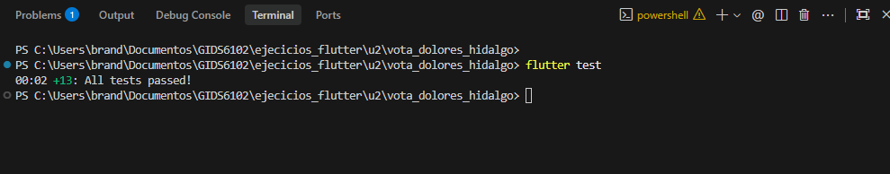
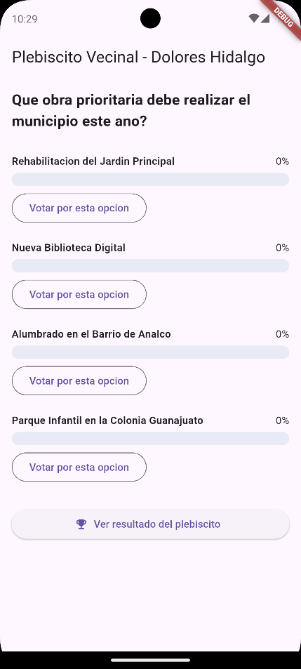
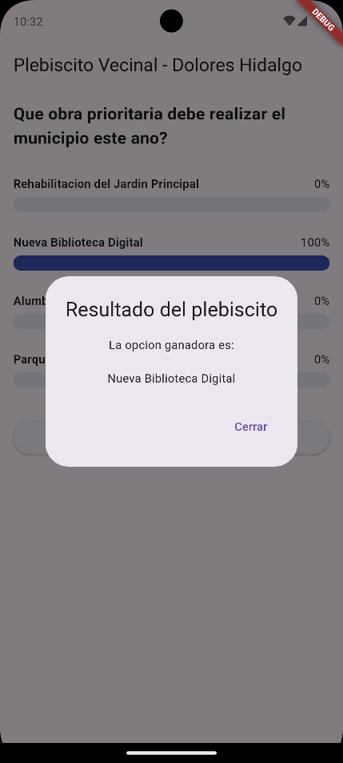
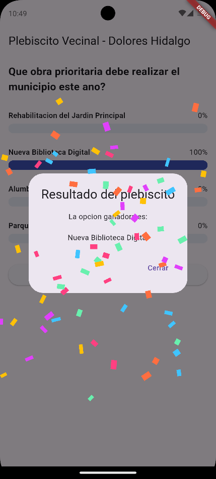
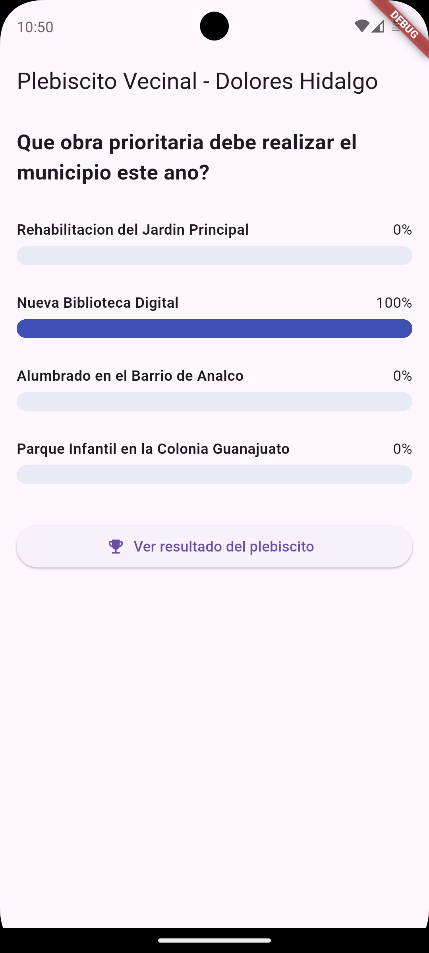

# 🗳️ Vota Dolores Hidalgo — Plebiscito Vecinal con TDD

> **Desarrollo Móvil Integral** — Unidad 2  
> **Proyecto complementario de práctica TDD con animaciones fluidas**

---

## 👤 Información del Estudiante

- **Alumno:** Brandon Gustavo Mendoza Amaro
- **Matrícula:** 1223100384
- **Grupo:** GIDS6102
- **Materia:** Desarrollo Móvil Integral (DMI)
- **Repositorio:** [U2_DMP_Plebiscito-](https://github.com/gus-p3/U2_DMP_Plebiscito-)

---

## 📌 ¿Qué es este proyecto?

**Vota Dolores Hidalgo** es una aplicación móvil de plebiscito vecinal digital construida al **100% bajo la metodología TDD (Test-Driven Development)** en Flutter / Dart.

El municipio propone una consulta ciudadana:
> **"¿Qué obra prioritaria debe realizar el municipio este año?"**

Con opciones reales de la comunidad:
1. *Rehabilitación del Jardín Principal*
2. *Nueva Biblioteca Digital*
3. *Alumbrado en el Barrio de Analco*
4. *Parque Infantil en la Colonia Guanajuato*

Los vecinos participan emitiendo su voto; los resultados se reflejan en **barras dinámicas con animaciones suaves**, y al consultar el resultado final se revela al ganador mediante un diálogo con animación elástica, escala y **efecto de confeti personalizado**.

---

## 🛡️ Reglas de Negocio Protegidas con Pruebas

A diferencia de proyectos casuales, este sistema implementa reglas de negocio críticas protegidas mediante pruebas unitarias e integración:

1. **Voto único:** Cada ciudadano (identificado por ID) puede votar únicamente una vez.
2. **Opción válida:** Solo se computan votos destinados a opciones existentes.
3. **Fecha de cierre:** Se bloquea cualquier intento de sufragio posterior al límite temporal.
4. **Cálculo seguro de porcentajes:** Los porcentajes se calculan con precisión, evitando divisiones entre cero (`NaN`) cuando no existen votos aún.
5. **Detección de empates:** Si múltiples opciones comparten la máxima votación, el sistema reconoce el empate formalmente en lugar de escoger al azar.
6. **Manejo de estados con Enums:** Uso de `ResultadoVoto` para evitar el antipatrón de excepciones en el flujo normal.

---

## 📂 Estructura Limpia del Proyecto

El proyecto mantiene una separación estricta entre la lógica de negocio (Dart puro) y la interfaz gráfica:

```text
vota_dolores_hidalgo/
├── docs/
│   └── capturas/                   # Capturas de evidencia del documento Word
│       ├── evidencia_1.png
│       ├── evidencia_2.png
│       ├── evidencia_3.png
│       ├── evidencia_4.png
│       ├── evidencia_5.png
│       └── evidencia_6.png
├── lib/
│   ├── logica/
│   │   ├── resultado_voto.dart     # Enum con estados de respuesta del voto
│   │   └── servicio_votacion.dart  # Lógica central del sistema de votación
│   ├── modelos/
│   │   ├── opcion_votacion.dart    # Modelo de opción individual y contador
│   │   ├── resultado_opcion.dart   # DTO con opción y su porcentaje calculado
│   │   └── votacion.dart           # Entidad del plebiscito y padrón de votantes
│   ├── presentation/
│   │   ├── confeti_widget.dart     # CustomPainter y animación de confeti
│   │   └── votacion_screen.dart    # UI con TweenAnimationBuilder y diálogos
│   └── main.dart                   # Punto de entrada de la aplicación
├── test/
│   └── servicio_votacion_test.dart # 13 pruebas unitarias y de integración
└── Manual_TDD_VotaDoloresHidalgo.docx
```

---

## 🔄 Ciclo TDD — Desarrollo Guiado por Rondas

El desarrollo se ejecutó siguiendo rigurosamente el ciclo **Rojo 🔴 ➔ Verde 🟢 ➔ Refactor 🔵**:

### 🔴 Ronda 1 — Registrar un voto válido
- **Prueba:** Verifica que votar por una opción válida incremente su contador y devuelva `ResultadoVoto.exitoso`.
- **Implementación:** `ServicioVotacion.registrarVoto()` con búsqueda de opción y aumento en su contador.

### 🔴 Ronda 2 — Rechazar opciones inexistentes
- **Prueba:** Se intenta votar con un ID inexistente esperando `ResultadoVoto.opcionInvalida`.
- **Implementación:** Validación `if (opcion == null) return ResultadoVoto.opcionInvalida;`.

### 🔴 Ronda 3 — Prevenir voto duplicado
- **Prueba:** Un mismo `idUsuario` intenta emitir dos votos; el segundo debe fallar con `ResultadoVoto.usuarioYaVoto`.
- **Implementación:** Registro en un `Set<String> votantes` y validación temprana *guard clause*.

### 🔴 Ronda 4 — Cálculo seguro de porcentajes
- **Pruebas:** 
  - Cálculo proporcional de 75% vs 25%.
  - Escenario inicial con 0 votos donde todas las opciones deben reportar 0% sin generar `NaN`.
- **Implementación:** Uso de `fold` y operador ternario para mitigar la división entre cero.

### 🔴 Ronda 5 — Determinar ganador
- **Prueba:** Obtener la opción con la votación más alta.
- **Implementación:** Reducción sobre la lista de opciones para obtener el valor máximo y filtrar las coincidentes.

### 🔴 Ronda 6 — Reconocimiento de empates
- **Prueba:** Varias opciones con el mismo número de votos máximos deben retornarse simultáneamente.
- **Implementación:** Confirmación de que el filtrado `where` preserva la multiplicidad de ganadores.

### 🔴 Ronda 7 — Control de fecha y horario de cierre
- **Prueba:** Rechazo de votos cuando la votación ya expiró (`ResultadoVoto.votacionCerrada`).
- **Implementación:** Validación temporal con `DateTime.now().isAfter(votacion.fechaCierre)`.

### 🔵 Ronda 8 — Refactorización con *Guard Clauses*
- **Refactor:** Reorganización de las condiciones de validación para máxima legibilidad en español (`yaCerro`, `yaVoto`, `opcion == null`).

### 🧪 Prueba de Integración: Plebiscito Vecinal Completo
- Simulación completa de interacción ciudadana: varios vecinos emitiendo su voto, un intento de fraude/voto repetido interceptado, y la proclamación correcta del ganador.

---

## 🚀 Retos de Extensión Desarrollados

1. **Inyección de Dependencia de Reloj (`DateTime Function()`):**  
   Permite realizar pruebas de expiración temporales deterministas sin depender del reloj del sistema operativo.
2. **Límite Máximo de Votantes:**  
   Capacidad de limitar el censo/padrón de votos; al sobrepasar el límite se retorna `ResultadoVoto.limiteAlcanzado`.
3. **Modo de Votación Anónima:**  
   Garantía de privacidad donde se valida que el usuario ya votó sin vincular su identidad a la opción seleccionada.
4. **Animación de Confeti Personalizada (`CustomPainter`):**  
   Implementación en `lib/presentation/confeti_widget.dart` usando `ConfetiPainter` con rotación, física y colores festivos sobre el diálogo de resultados.

---

## 📸 Evidencias de Ejecución (Capturas del Manual)

A continuación se presentan las capturas integradas directamente desde el documento del manual:

### 1. Pruebas Unitarias e Integración (100% en Verde)
Las **13 pruebas automatizadas** pasan exitosamente ejecutando `flutter test`:

<p align="center">
  
</p>

```bash
PS C:\...\vota_dolores_hidalgo> flutter test
00:02 +13: All tests passed!
```

---

### 2. Flujo de Votación en la Interfaz Móvil

| Estado Inicial (0% en Opciones) | Voto Emitido (Barra Animada 100%) | Diálogo de Ganador (Elastic Out) |
| :---: | :---: | :---: |
|  |  |  |
| *Opciones con 0% y botones activos* | *Barra animada y bloqueo de voto duplicado* | *Diálogo animado con la opción ganadora* |

---

### 3. Reto de Animación de Confeti y Resultados Finales

| Celebración con Confeti Animado (`CustomPainter`) | Estado Final del Plebiscito |
| :---: | :---: |
|  |  |
| *Efecto festivo generado por `ConfetiPainter`* | *Resultados finales computados y presentados* |

---

## 📋 Checklist de Cumplimiento TDD

- [x] **Reglas de negocio protegidas:** Cada regla (voto único, opción existente, fecha de cierre, empates) cuenta con su prueba correspondiente.
- [x] **Flujo con Enums:** `ResultadoVoto` modela el flujo sin abusar de excepciones para condiciones ordinarias.
- [x] **A prueba de división por cero:** `obtenerResultados()` maneja de forma segura votaciones vacías (0%).
- [x] **Separación de responsabilidades:** `VotacionScreen` no contiene reglas de negocio ni lógica de cálculo.
- [x] **Prueba de integración integral:** Simulación completa de votantes con intento de voto repetido.
- [x] **Retos opcionales cubiertos:** Inyección de reloj, límite de votantes, votación anónima y confeti con CustomPainter.

---

## 🛠️ Instrucciones de Ejecución

### Pruebas Automatizadas
Para ejecutar la suite completa de pruebas unitarias y de integración:
```bash
flutter test
```

### Ejecutar la Aplicación
Para correr la aplicación en emulador o dispositivo físico:
```bash
flutter run
```
